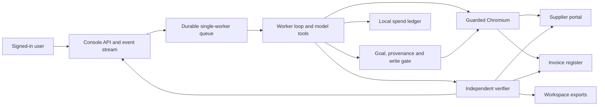

# CentrAlign task worker

CentrAlign takes a signed-in user's request, operates a real Chromium browser across a fictional supplier portal and invoice register, and reports completion only after independent read-back checks pass. The sandbox company is Halden Traders. The console frontend lives in `console/`; the Python backend lives in `worker/`, `sandbox/`, and `evals/`.

## Run locally

Requires Python 3.11 or newer, `uv`, and Playwright Chromium.

```sh
uv sync
uv run playwright install chromium
cp .env.example .env
# Set AICREDITS_API_KEY locally in .env for live runs.
make dev
```

Open <http://127.0.0.1:8100>. The console is served from `console/dist` when the frontend has been built. The portal is at `:8101` and the register at `:8102`. The local demo accounts are `asha@example.com` (admin), `ravi@example.com` (Larkspur Supplies and Brightfen Paper), and `meera@example.com` (Kestrova Components). Their default passwords are `asha-demo`, `ravi-demo`, and `meera-demo`; override them with `ASHA_PASSWORD`, `RAVI_PASSWORD`, and `MEERA_PASSWORD` in `.env`. The console and register use the same demo identities. No real supplier or accounting system is involved.

`make dev` starts the live worker. For frontend work without provider calls, set `WORKER_ENGINE=replay` before starting the console server. Runtime databases, traces and screenshots are kept under `data/` and ignored by Git. The browser's sandbox services use local HTTP only.

## Test and evaluate

```sh
make test
make lint
make eval
make eval-live LIMIT_INR=30
```

`make test` and `make eval` use only the scripted fake model and need no provider key. The fake evaluation runs each case with fresh databases and a frozen 2026-10-03 reference date; its [generated report](evals/REPORT.md) lists all task and control outcomes. `make eval-live` uses the locally configured key with `google/gemini-2.5-flash-lite`, even if the demo server's `LLM_MODEL` selects another model. It writes a separate [live report](evals/LIVE_REPORT.md) and lists the script-only faults omitted from the live tier. The live evaluation makes paid calls, stops when its local ledger cannot reserve another run, and does not repeat cases automatically.

The [smoke test notes](docs/SMOKE.md) record the gateway endpoint, usage and small-call costs without the key. The full [backend design](docs/DESIGN.md) describes the safety and recovery paths.

## How it works



The model proposes the next tool call. Code resolves and freezes the task's sources, checks every business field before a write, and owns approvals, retry decisions and the final status. The browser network guard permits one exact approved form body and blocks probe APIs, unapproved POSTs and off-sandbox navigation. A one-time form token plus a write-ahead pending record lets the worker reconcile a timeout or restart without creating a duplicate. `completed` requires a passing `VerificationResult`; the console cannot set it.

## Decisions and assumptions

- The demo uses FastAPI, SQLite, Playwright Chromium, Pydantic, the OpenAI-compatible client, and AICredits Gemini 2.5 Flash Lite for live evaluation. `LLM_MODEL` controls the live demo server; tests use `FakeProvider`.
- The portal and register are seeded fictional apps. They have simple HTML forms and no JavaScript autosave. Supplier evidence is exposed as labeled document fields; scanned PDFs and arbitrary websites are outside this build.
- The local spend ledger reserves before sending a request, then settles from gateway-reported INR cost. The ₹30 global and ₹4 per-run limits are estimates, not a hard provider ceiling. Missing usage or timed-out calls retain their reservation.
- Console sessions are local and in memory. One backend process and one worker queue are assumed. The register still enforces permissions through both its HTML and API routes.

## Verified and open

The deterministic report is generated from the current code and lists exact numerators and denominators. Automated tests cover the portal, register, owner and role denials, provenance, write gate, approval expiry and policy changes, lost-response reconciliation, browser network interception, queue recovery, console API and SSE, and isolated eval cases. The live report records paid Flash Lite outcomes and settled costs separately; a fake-provider pass is not a live-model pass.

<!-- EVAL_METRICS_START -->
### Fake provider

| Metric | Result |
| --- | ---: |
| Task success | 20/20 |
| Control pass | 11/11 |
| Field correctness | 10/11 |
| False completions | 0/31 |
| Unauthorized writes | 0/31 |
| Duplicate records | 0/31 |
| Tool calls | 280/31 runs |
| Latency | 10.51 s/31 runs |
| Settled cost | ₹0.000000/31 scenarios |

### Flash Lite live

| Metric | Result |
| --- | ---: |
| Task success | 6/15 |
| Control pass | 11/11 |
| Field correctness | 3/4 |
| False completions | 0/26 |
| Unauthorized writes | 0/26 |
| Duplicate records | 0/26 |
| Tool calls | 383/26 runs |
| Latency | 430.15 s/26 runs |
| Settled cost | ₹5.293427/26 scenarios |
<!-- EVAL_METRICS_END -->

The remaining work for a production system would be gateway-side hard budget controls, a stronger model conversation format for arbitrary sites, OCR or vision evidence, persistent multi-process sessions and queue coordination, and security review before any real company data is connected. No deployment, real payment action, or non-sandbox accounting write has been verified.
