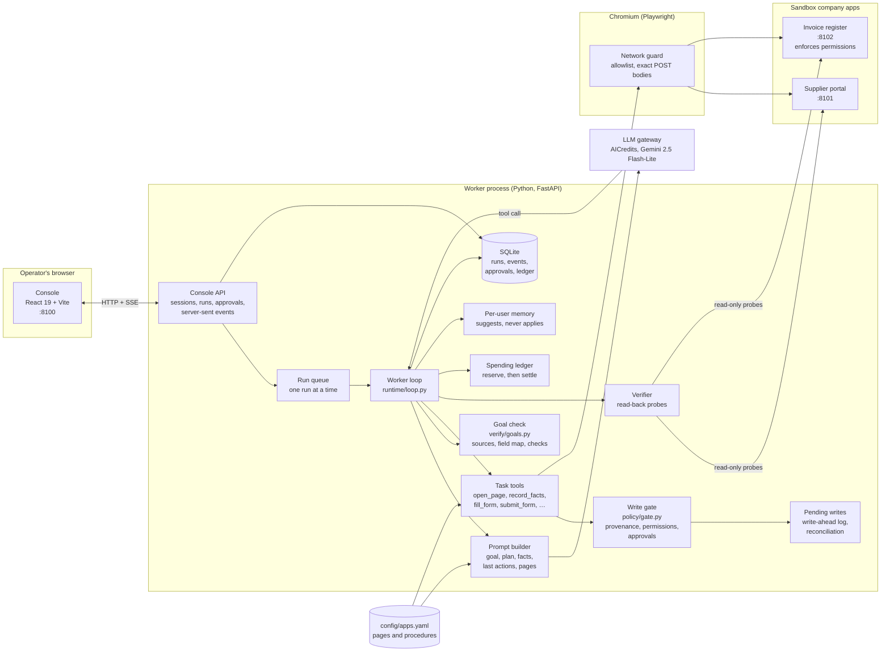
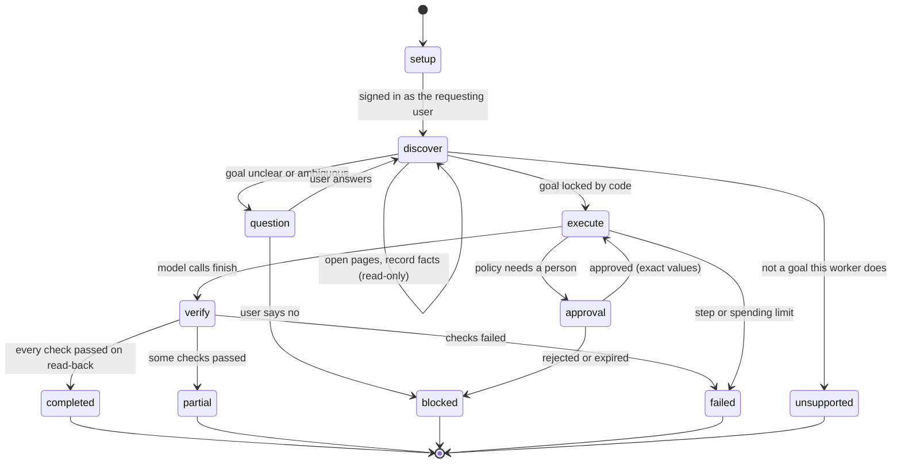
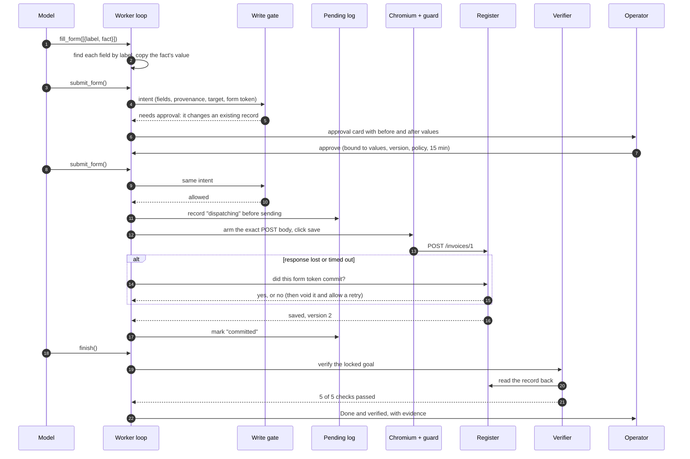
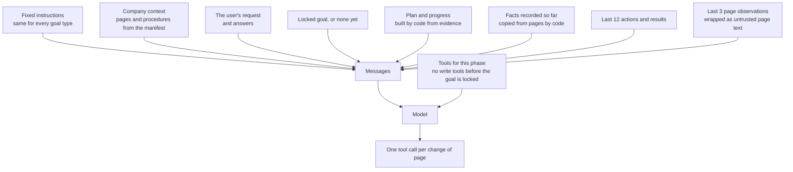
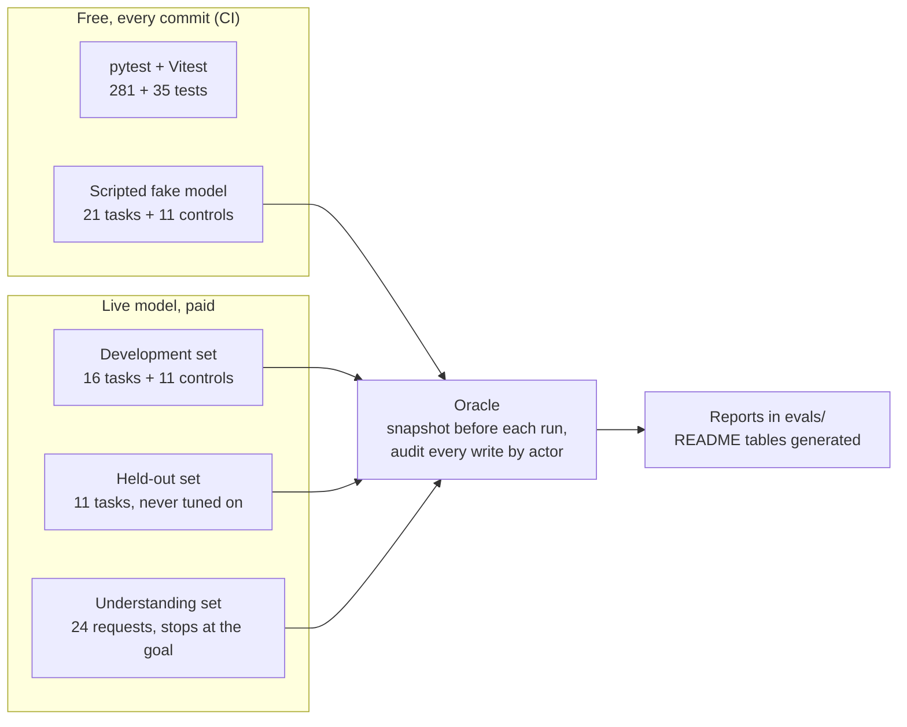
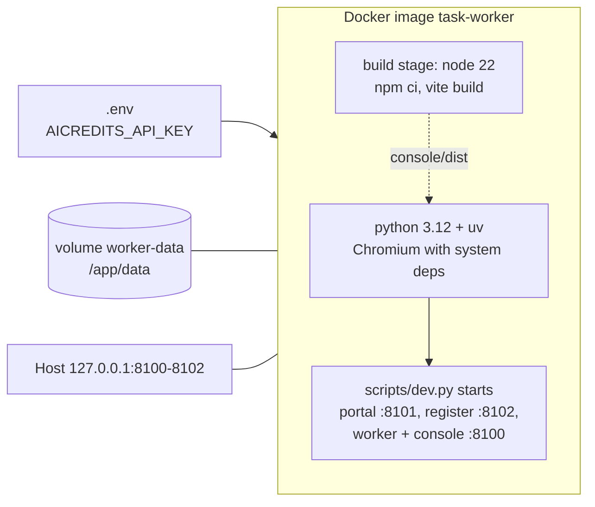

# Architecture

Diagrams of the system as built. [DESIGN.md](DESIGN.md) explains the reasoning behind each part, and [INTERFACES.md](INTERFACES.md) fixes the console API.

The core idea: **the model picks the next action; code decides what is allowed, where each value came from, and whether the work is done.**

## 1. Components

| Part | Responsibility | Code |
| --- | --- | --- |
| Console | Start tasks, answer questions, approve exact values, read evidence | `console/src` |
| Console API | Sign-in, runs, approvals, answers, live event stream | `worker/console` |
| Worker loop | One model call per step, dispatch of task tools, phase changes | `worker/runtime/loop.py` |
| Manifest | What each app's pages are and which pages each goal reads and writes | `config/apps.yaml`, `worker/runtime/apps.py` |
| Goal check | Turns a proposed goal into a locked contract with frozen sources and checks | `worker/verify/goals.py` |
| Write gate | Refuses any write without provenance, permission or a valid approval | `worker/policy` |
| Network guard | Blocks other origins, probe APIs and any POST that is not the approved body | `worker/tools/network_guard.py` |
| Verifier | Reads the systems back and decides `completed` | `worker/verify/verifier.py` |
| Spending ledger | Reserves an estimate before each call; settles from the gateway's cost | `worker/llm/ledger.py` |

## 2. A run's phases

Run statuses are `queued`, `running`, `awaiting_input`, `awaiting_approval`, `completed`, `partial`, `blocked`, `failed`, `unsupported` and `interrupted`. Only the verifier can produce `completed`.

## 3. One write, end to end

## 4. What the model sees each turn

## 5. Evaluation tiers

## 6. Deployment

